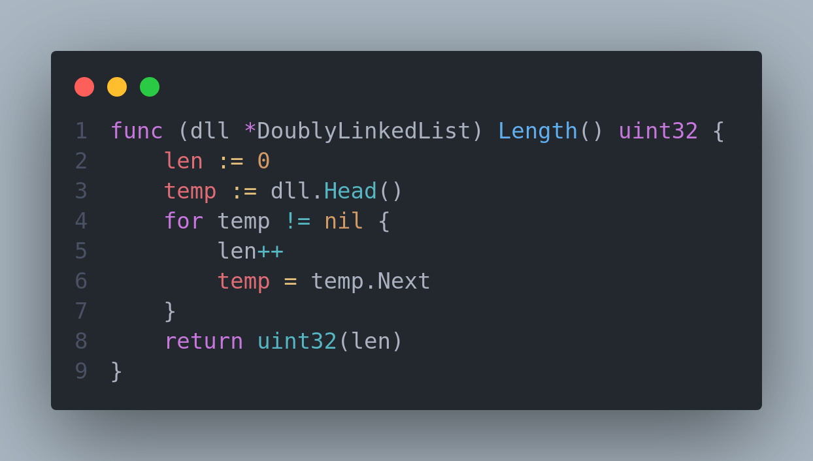

# Inca

_✨ An incredibly straightforward implementation of LRU Cache with a TTL system and Command parser ✨_

    

> 🌟💡 Disclaimer: Please note that this project was built exclusively for educational purposes. I want to emphasize that while I have made efforts to ensure the quality of my code, I cannot guarantee its compatibility with your specific project. Therefore, I kindly request that you exercise caution when incorporating this code into your own work. My primary goal in undertaking this endeavor was to deepen my understanding of caching mechanisms while immersing myself in the enchanting world of golang, a language I have recently embraced. Let this project serve as a source of inspiration and knowledge, but remember to approach its utilization with prudence and care.

## ✨🌟 Features 🌟✨

- 🔃 LRU Eviction Policy
- ⌛ TTL system
- ⌨️ Command parser for executing commands from queries
- ⚡️ Blazingly fast performance

## 🌟 Why this project? 🤔

This is one of those questions that I often encounter when I share with my developer friends that I'm embarking on the exciting journey of building something from scratch.

Most of the time, the answer is simple, yet filled with curiosity. 😄 I have an insatiable thirst for understanding how technology works behind the scenes and a genuine desire to dive into the minds of its ingenious inventors as they shaped it.

Hence, I decided to undertake this project! 🚀 Not only did I want to satisfy my curiosity, but I also aimed to explore the profound impact that seemingly simple decisions, like selecting the right data structure, can have on performance at a large scale.

✨💡✨

## 💡 What Did I Discover?

I had an eye-opening realization about the immense impact of data structures and algorithms on project performance. It's no laughing matter! Even seemingly small issues like excessive heap memory allocation can significantly hinder application performance, even with a garbage collector in place. I also gained a valuable lesson in the importance of striving for O(1) operations. A seemingly innocent O(N) calculation can swiftly drag down performance, as you'll soon witness in the upcoming section.

## ✨ An eye-opening instance ✨

One of those magical moments where pure joy enveloped me was during the optimization phase of this project. 🚀 After running extensive benchmarks on my implementation of the LRU cache, I stumbled upon a performance bottleneck that was significantly dragging down my code's efficiency.

The LRU cache operates on the principle of removing the least recently used entry when adding a new one, given that the capacity is reached. This means that my cache has a maximum capacity property. 📚 The benchmark test I conducted was elegantly simple. I created a cache with a capacity of `C`. Then, I added new entries to the cache, ensuring that no keys were repeated, repeating this process 10 times the capacity (`10*C`). For instance, if my cache had a capacity of 10^4 entries, I set the cache for 10^5 iterations. This test brilliantly exposed how the cache would perform when faced with adding new keys, even after reaching its maximum capacity, on a grand scale.

To my astonishment, the performance of my cache system was utterly underwhelming. 😞 The benchmarking results painted a rather grim picture.

The test ran only once, and on average, it took a whopping 1,699,933,125 nanoseconds per operation. 🕰️ That's abysmal for a cache system that's meant to enhance application speed. As I delved into debugging, I unearthed the culprit—the dreaded `Length()` method. Yes, you heard it right, a seemingly innocuous `Length()` method.

As you can see, the function had a time complexity of O(N) since it traversed the entire doubly linked list each time it was called. Initially, this might not seem like a major issue, but when the cache reached its capacity, it resulted in painfully slow performance. Identifying this as the root cause, I employed an ingenious technique of tracking the length of the doubly linked list directly within the struct. This change effectively transformed the time complexity of the `Length()` method to a lightning-fast O(1). 💡 With the optimized implementation in place, I reran the benchmark test using the same parameters. The results spoke for themselves.

The test ran an astounding one billion times, with an average execution time of approximately 0.2411 nanoseconds per operation. 🚀 I might not be a caching expert, but it's crystal clear that this improvement far surpasses my previous implementation. These results filled me with immense joy and a sense of accomplishment. 😊 Thanks to all the enlightening videos I watched on data structures and algorithms (DSA), I finally mastered the art of optimizing code independently and to an extraordinary extent.

## Conclusion 🚀

🔬 Never underestimate the power of testing and benchmarking your code. 📊 It's the key to unveiling hidden bottlenecks and optimizing performance. 🕵️‍♀️ Embrace your debugger as a trusty companion, never shy away from its assistance. 🐛 Be bold and experiment fearlessly. ✨ Explore unconventional solutions and let your creativity shine. 🌟 Witness the remarkable transformation from 1,699,933,125 nanoseconds per operation to a blazing-fast 0.2411 nanoseconds per operation. That's an incredible improvement of approximately 7.05 \* 10^9 times! 🚀 Take a moment to step back and bask in the glory of your hard-earned achievements. 🎉

---
